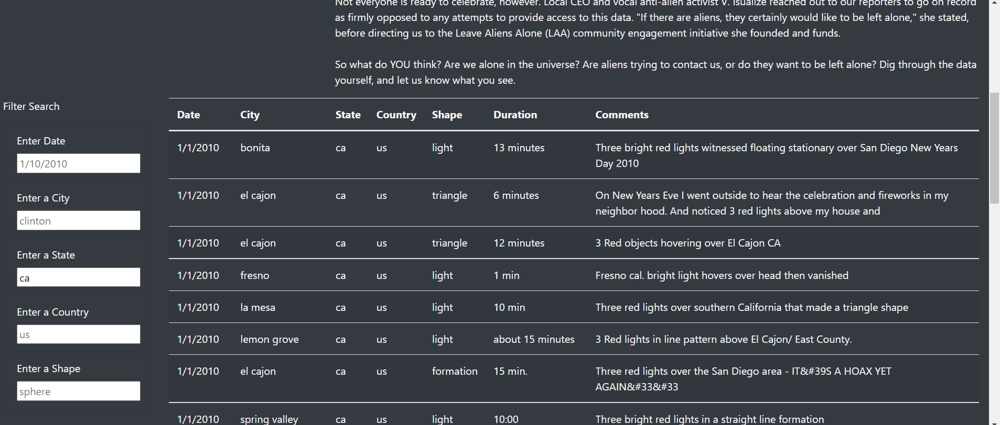

## Overview of Project: Explain the purpose of this analysis.
    There was a need to add additional enhancement to Dana’s webpage which would help in furthur drilling though UFO dataset. More in depth analysis of UFO sightings was needed by allowing users to filter for multiple criteria at the same time. In addition to the date, additional table filters for the city, state, country, and shape are to be added.

## Results: Describe to Dana how someone might use the new webpage by walking her through the process of using the search criteria. Use images of your webpage during the filtering process to support your explanation.
    Four more search attributes were added : city, state, country, and shape. These will be similar to the "Enter Date" list element. Each element should have the same "id" as the object properties in the data.js file.
   
  First screenshot is of full data
    

  Second screenshot is of data where search was made for state='nj'

    

 Third screenshot is of data where search was made for state='ca'
    

 Fourth screenshot is of data where search was made for state='ca' and then furthur on date='1/1/2010'
    

## Summary: In a summary statement, describe one drawback of this new design and two recommendations for further development.
  Drawback
    There was no data to reinforce or validate the claims done on UFO sightings.
  Recommendations
    1-Addition of number of people who witnessed UFO sightings
    2-Allow flexibility to users to search furthur by duration and shape as well. In addition we can have a choice box to check on which all attributes are needed for furthur data drill down.